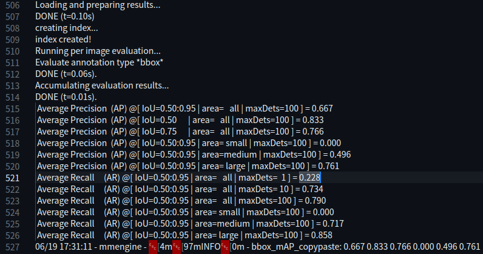
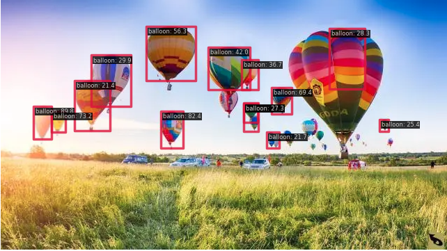

## 第三次作业

### 前言
- 本次作业上交的文件要包含**配置文件、训练日志、验证集评估指标、预测结果图、可视化分析图[balloon_det.ipynb](balloon_det.ipynb)**

- **并将验证集评估指标、预测图、可视化分析图贴在readme.md中**。

- 文件说明：

  - 配置文件见:[balloon_rtmdet.py](mmdetection/balloon_dataset/balloon_rtmdet.py)

  - 训练日志见:[20230619_171252.log](mmdetection/work_dirs/balloon_rtmdet/20230619_171252/20230619_171252.log)

  - 验证集评估日志见:[20230619_173105.log](mmdetection/work_dirs/balloon_rtmdet/20230619_173105/20230619_173105.log)  
  
---

### rtmdet（详细见配置文件）:

- 验证集评估指标：

  

- 预测图片：

  

- 可视化分析：
   
  
  

  