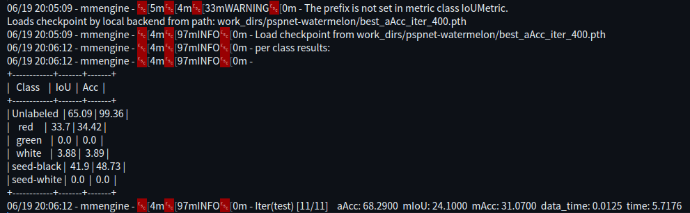

## 第四次作业：

- 本次作业上交的文件要包含**配置文件、训练日志、测试集评估指标、预测结果图、预测视频[pspnet_watermelon.ipynb](pspnet_watermelon.ipynb)**

- **并将验证集评估指标、预测图贴在readme.md中**

- 文件说明：

  - 配置文件见:[pspnet-watermelon.py](mmsegmentation/Watermelon87_Semantic_Seg_Mask/pspnet-watermelon.py)

  - 训练日志见:[20230619_190817.log](mmsegmentation/work_dirs/pspnet-watermelon/20230619_190817/20230619_190817.log)

  - 测试日志见:[20230619_200504.log](mmsegmentation/work_dirs/pspnet-watermelon/20230619_200504/20230619_200504.log)  
  

- 验证集评估指标：

  

  - 原图：

  

  - 预测图片：

    

